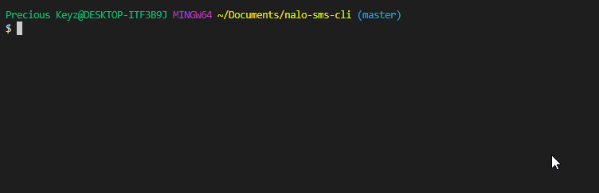

# Nalo-SMS-ClI [](https://badge.fury.io/js/nalo-sms)

## **Overview**

Send messages using Nalo Solutions Messaging Service directly from your Command Line Interface. You need to create a Nalo account [here](https://sms.nalosolutions.com/nalosms/signup.php/) in order to use this API.

## Demo

<p align="center">

</p>

## Installation

`$ npm install -g nalo-sms`

## Docs

    Usage: nalo-sms [command] [options]

    Send messages using Nalo Solutions Messaging Service directly from your CLI.

    Options:
        -v, --version          output the version number
        -h, --help             output usage information

    Commands:
        set [options] <value>  Set global config for nalo-sms-cli
        send                   Send message from the cli

## Usage

The commands available are: `nalo-sms send`, `nalo-sms set`

#### Set Global Username command

`$ nalo-sms set --user precious`

#### Set Global Password command

`$ nalo-sms set --pass helloworld`

#### Send SMS command

```
$ nalo-sms send
? Choose Message Type Plain Text (GSM 3.38 Character Encoding)
? Type your message now 💬  Hello World
? Type message source Precious
? Type Destination number 📱  024XXXXXXX
? Is Delivery report required Yes
? Use Global Username Yes
? Use Global Password Yes
```

## Contributing

All feedback and suggestions are welcome, just post an issue!

## Author

[Precious Keyz](https://codekeyz.netlify.com/)

License

---

MIT
